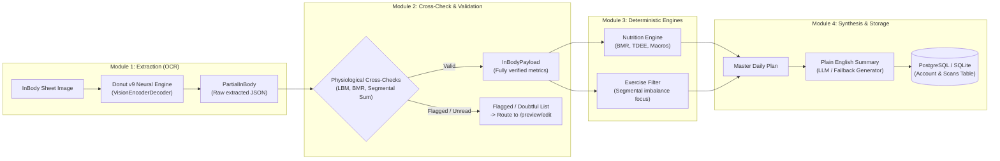
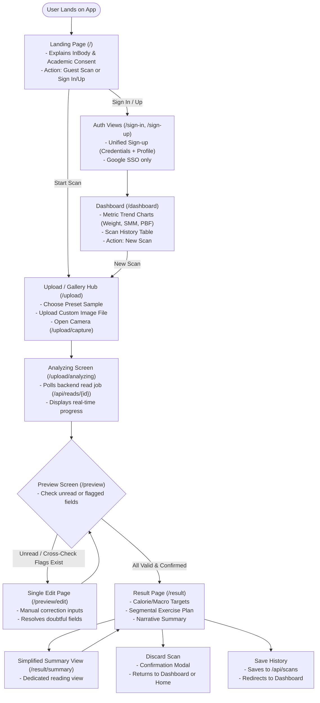

# InForm (CERA) — Project Handoff & Flow Alignment

> **Target Audience**: Incoming Agent & Engineering Team  
> **Primary Objective**: **Diagnose, refine, and perfect the end-to-end program and user flow.**  
> **Status**: Core features implemented, Donut OCR v9 model running locally, 290/290 tests passing, 17/17 Next.js routes compiling.

---

## 1. Executive Summary

InForm is an automated body composition analysis and health planning application designed around InBody printouts (specifically InBody 270). It features a **FastAPI backend** (Python 3.11) with a self-hosted **Donut OCR** model and a **Next.js 16 (App Router) + Tailwind CSS** frontend.

The project upholds a strict **Zero-PHI Persistence guarantee (ADR-0011)**: raw InBody sheet images are never stored at rest or sent to third-party cloud APIs.

```
+---------------------------------------------------------------------------------------+
|                                    PROJECT STATUS                                     |
|  * Backend Tests:      290 PASSED, 2 SKIPPED, 0 FAILED (100% pass rate)               |
|  * Frontend Build:     17/17 routes compiled cleanly (0 TypeScript/lint errors)        |
|  * OCR Engine:         Donut v9 checkpoint loaded locally in models/donut-270-v9      |
|  * Live Capabilities:  GET /api/capabilities -> {"live_read_available": true}        |
+---------------------------------------------------------------------------------------+
```

---

## 2. System Architecture & 4-Module Pipeline



---

## 3. Visual User Journey & State Lifecycle

The user flow bridges guest exploration, user onboarding, document intake, OCR error resolution, and longitudinal history tracking.



---

## 4. Current State: What Is Working & Tested

### 1. Donut OCR Model Checkpoint (v9)
* **Weights downloaded**: [`models/donut-270-v9/`](file:///C:/Users/VICTUS/OneDrive/Documents/Edwin's_Project/CERA/models/donut-270-v9) contains all 6 required HuggingFace artifacts: `config.json`, `generation_config.json`, `model.safetensors` (809 MB), `processor_config.json`, `preprocessor_config.json`, `tokenizer.json`, and `tokenizer_config.json`.
* **Execution**: Tested on [`data/samples/synthetic_270_clean.png`](file:///C:/Users/VICTUS/OneDrive/Documents/Edwin's_Project/CERA/data/samples/synthetic_270_clean.png). Successfully extracts all body composition metrics with **0 unread** and **0 flagged** fields.
* **Auto-Resolution**: [`src/inform/extract.py`](file:///C:/Users/VICTUS/OneDrive/Documents/Edwin's_Project/CERA/src/inform/extract.py) checks `models/donut-270-v9` first, falling back to `models/donut-both-v5` or `INFORM_DONUT_CKPT`.
* **Live capability**: `GET /api/capabilities` returns `live_read_available: true`.

### 2. "Too Blurry" Sample Pipeline Fix
* **Issue**: Selecting a sample from the gallery previously triggered a false "Too Blurry" error because an uninitialized `readId` sent sample URLs into base64 decoders.
* **Fix**: Guarded with `readIdResolved` and [`isSubmittableImageData()`](file:///C:/Users/VICTUS/OneDrive/Documents/Edwin's_Project/CERA/frontend/lib/photo.ts). Both instant stored reads and live neural scans execute without error.

### 3. UI/UX Overhaul
* **Unified Sign-Up** ([`frontend/app/sign-up/page.tsx`](file:///C:/Users/VICTUS/OneDrive/Documents/Edwin's_Project/CERA/frontend/app/sign-up/page.tsx)): Credentials + complete physical profile defaults on one screen; independent eye-icon password toggles.
* **Simplified Sign-In** ([`frontend/app/sign-in/page.tsx`](file:///C:/Users/VICTUS/OneDrive/Documents/Edwin's_Project/CERA/frontend/app/sign-in/page.tsx)): Clean Google SSO (Apple/Facebook removed); post-login redirects to `/dashboard`.
* **Landing Page** ([`frontend/app/page.tsx`](file:///C:/Users/VICTUS/OneDrive/Documents/Edwin's_Project/CERA/frontend/app/page.tsx)): Explanatory InBody overview and student project consent notice embedded directly.
* **Dashboard & History** ([`frontend/app/dashboard/page.tsx`](file:///C:/Users/VICTUS/OneDrive/Documents/Edwin's_Project/CERA/frontend/app/dashboard/page.tsx)): Profile bar, interactive metric progress charts ([`TrendChart.tsx`](file:///C:/Users/VICTUS/OneDrive/Documents/Edwin's_Project/CERA/frontend/components/TrendChart.tsx)), and past scan drill-down at [`/history/[id]`](file:///C:/Users/VICTUS/OneDrive/Documents/Edwin's_Project/CERA/frontend/app/history/[id]/page.tsx).
* **Universal Back Navigation** ([`BackButton.tsx`](file:///C:/Users/VICTUS/OneDrive/Documents/Edwin's_Project/CERA/frontend/components/BackButton.tsx)): Present across all 16 sub-pages (strictly excluded on landing).
* **Single Edit View** ([`frontend/app/preview/edit/page.tsx`](file:///C:/Users/VICTUS/OneDrive/Documents/Edwin's_Project/CERA/frontend/app/preview/edit/page.tsx)): Consolidated screen for updating any unread or doubtfully read metrics.
* **Result Refinements** ([`frontend/app/result/page.tsx`](file:///C:/Users/VICTUS/OneDrive/Documents/Edwin's_Project/CERA/frontend/app/result/page.tsx)): "Simplify" button leading to [`/result/summary`](file:///C:/Users/VICTUS/OneDrive/Documents/Edwin's_Project/CERA/frontend/app/result/summary/page.tsx), and "Discard this scan" with confirmation protection.

---

## 5. Flow-Fixing Mission: Specific Areas for the Incoming Agent

The user explicitly wants the incoming agent to **fully focus on auditing and perfecting the flow of the program**. Here is the prioritized checklist of flow touchpoints to evaluate:

### Flow Point 1: Guest-to-Account Transition (Preserving In-Memory Scans)
* **Scenario**: A user completes a scan as a guest (`Landing -> Upload -> Analyzing -> Preview -> Result`).
* **Friction**: On `/result`, they click "Save History".
* **Inspection**:
  - Does the UI detect that the user is unauthenticated and prompt them to log in or register?
  - When redirected to `/sign-in` or `/sign-up`, is the current scan payload preserved in `sessionStorage` or local state so it is NOT lost after authenticating?
  - After logging in, are they smoothly redirected back to save that pending scan?

### Flow Point 2: Back Navigation State Integrity
* **Scenario**: A user navigates back using the new `BackButton` from `/preview`, `/preview/edit`, or `/result`.
* **Inspection**:
  - Verify [`frontend/lib/session.ts`](file:///C:/Users/VICTUS/OneDrive/Documents/Edwin's_Project/CERA/frontend/lib/session.ts) and [`frontend/lib/inbody.ts`](file:///C:/Users/VICTUS/OneDrive/Documents/Edwin's_Project/CERA/frontend/lib/inbody.ts).
  - Does clicking "Back" from `/preview/edit` safely preserve previously entered corrections?
  - Does clicking "Back" from `/result` allow the user to review the preview without triggering a redundant re-analysis?

### Flow Point 3: The Correction Loop (`/preview` -> `/preview/edit` -> `/preview`)
* **Scenario**: A scan has doubtful fields (e.g. `percent_body_fat` doesn't match `100 * (weight - LBM) / weight`).
* **Inspection**:
  - Ensure `/preview/edit` pre-fills the currently extracted values as placeholders/defaults.
  - When the user clicks "Apply Corrections", ensure the updated values are sent to `/reads` or `/plan` and cross-check flags are recalculated immediately.
  - Check that no required fields are dropped during this round-trip.

### Flow Point 4: Live Donut Neural Inference Experience
* **Scenario**: A user uploads a custom photo or selects "Scan Live Now" on a sample.
* **Inspection**:
  - Neural inference on CPU/GPU takes between 3 to 15 seconds.
  - Check [`frontend/app/upload/analyzing/page.tsx`](file:///C:/Users/VICTUS/OneDrive/Documents/Edwin's_Project/CERA/frontend/app/upload/analyzing/page.tsx) polling intervals and timeout resilience.
  - Ensure the user sees clear, reassuring progress steps (`Reading image...`, `Analyzing metrics...`, `Running physiological cross-checks...`).

### Flow Point 5: "Discard Scan" Lifecycle
* **Scenario**: A user decides not to keep a scan on `/result`.
* **Inspection**:
  - When confirming "Discard", verify that in-memory scan data is properly purged from `sessionStorage` (`INBODY_READ_KEY`, `INBODY_PAYLOAD_KEY`, etc.).
  - Ensure the redirect safely points to `/dashboard` (if logged in) or `/` (if guest) without orphaned state triggering subsequent errors.

---

## 6. How to Run & Verify

```powershell
# 1. Start the FastAPI Backend
.\.venv\Scripts\uvicorn backend.main:app --reload --host 127.0.0.1 --port 8000

# 2. Start the Next.js Frontend (in a separate terminal)
cd frontend
npm run dev

# 3. Run Backend Test Suite
.\.venv\Scripts\pytest.exe -q

# 4. Run Frontend Production Typecheck & Build
cd frontend
npm run build
```

---

## 7. Key File Registry

| Component | File Path |
| :--- | :--- |
| **Model Weights** | [`models/donut-270-v9/`](file:///C:/Users/VICTUS/OneDrive/Documents/Edwin's_Project/CERA/models/donut-270-v9) |
| **Engine Loader** | [`src/inform/extract.py`](file:///C:/Users/VICTUS/OneDrive/Documents/Edwin's_Project/CERA/src/inform/extract.py) |
| **Donut Runtime** | [`src/inform/engines/donut.py`](file:///C:/Users/VICTUS/OneDrive/Documents/Edwin's_Project/CERA/src/inform/engines/donut.py) |
| **Backend API** | [`backend/main.py`](file:///C:/Users/VICTUS/OneDrive/Documents/Edwin's_Project/CERA/backend/main.py) |
| **Landing Page** | [`frontend/app/page.tsx`](file:///C:/Users/VICTUS/OneDrive/Documents/Edwin's_Project/CERA/frontend/app/page.tsx) |
| **Sign-Up & Sign-In** | [`frontend/app/sign-up/page.tsx`](file:///C:/Users/VICTUS/OneDrive/Documents/Edwin's_Project/CERA/frontend/app/sign-up/page.tsx), [`frontend/app/sign-in/page.tsx`](file:///C:/Users/VICTUS/OneDrive/Documents/Edwin's_Project/CERA/frontend/app/sign-in/page.tsx) |
| **Dashboard & History** | [`frontend/app/dashboard/page.tsx`](file:///C:/Users/VICTUS/OneDrive/Documents/Edwin's_Project/CERA/frontend/app/dashboard/page.tsx), [`frontend/app/history/[id]/page.tsx`](file:///C:/Users/VICTUS/OneDrive/Documents/Edwin's_Project/CERA/frontend/app/history/[id]/page.tsx) |
| **Upload & Analyzing** | [`frontend/app/upload/page.tsx`](file:///C:/Users/VICTUS/OneDrive/Documents/Edwin's_Project/CERA/frontend/app/upload/page.tsx), [`frontend/app/upload/analyzing/page.tsx`](file:///C:/Users/VICTUS/OneDrive/Documents/Edwin's_Project/CERA/frontend/app/upload/analyzing/page.tsx) |
| **Preview & Edit** | [`frontend/app/preview/page.tsx`](file:///C:/Users/VICTUS/OneDrive/Documents/Edwin's_Project/CERA/frontend/app/preview/page.tsx), [`frontend/app/preview/edit/page.tsx`](file:///C:/Users/VICTUS/OneDrive/Documents/Edwin's_Project/CERA/frontend/app/preview/edit/page.tsx) |
| **Results & Summary** | [`frontend/app/result/page.tsx`](file:///C:/Users/VICTUS/OneDrive/Documents/Edwin's_Project/CERA/frontend/app/result/page.tsx), [`frontend/app/result/summary/page.tsx`](file:///C:/Users/VICTUS/OneDrive/Documents/Edwin's_Project/CERA/frontend/app/result/summary/page.tsx) |
