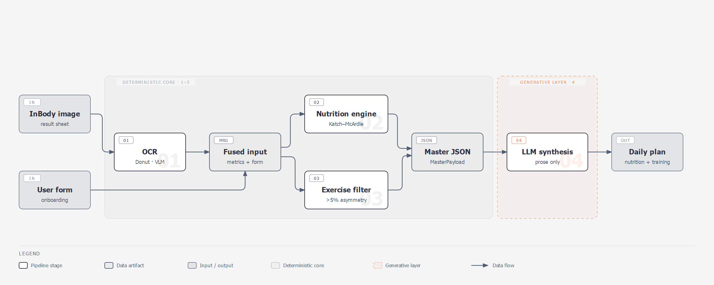

# InForm

InForm turns an InBody body scan into a personalized day of eating and training.

InBody machines are the body-composition scanners you find in a lot of gyms and clinics. You step on, and a minute later it prints a sheet full of numbers: your muscle mass, body fat, water, a per-limb breakdown, and more. Most people glance at it and file it away, because on its own it does not tell you what to actually do.

InForm reads that sheet, plus a few facts about you (your age, activity level, and whether you want to build muscle or lose fat), and writes you a concrete daily plan: how many calories and grams of protein, carbs, fat and fiber to eat, and a workout that targets your specific muscle imbalances.

The catch with most "AI fitness" tools is that you cannot tell where the numbers came from. InForm is built the other way around. Every number is computed by plain, auditable code from your scan. The AI is only allowed to write the words around those numbers, and a validation step stops it from quietly changing any of them.

## What you get

Give it your scan and your goal, and you get back something like this:

```
# Daily Fitness & Nutrition Plan (Fat Loss)

## Nutritional Targets
- Daily Energy Target: 1748 kcal (BMR: 1450 kcal, TDEE: 2248 kcal)
- Protein: 120.0g
- Carbohydrates: 207.7g
- Fats: 48.5g
- Fiber: 24.5g

## Recommended Workout Program
### Detected Imbalances & Focus Areas
- L/R arm lean-mass deviation 11.1%

### Exercise Routine
1. Single-arm dumbbell row  [corrective unilateral]  targets lats
2. Single-arm overhead press [corrective unilateral]  targets deltoids
3. Single-arm wrist curl     [corrective unilateral]  targets forearms
4. Rowing sprint intervals   [cardio hiit]            targets cardio
```

Notice the workout is not generic. This scan showed the right arm carrying 11% more lean mass than the left, so InForm prescribed single-arm corrective moves to even it out. A different scan produces a different plan.

## Try it in two minutes

You do not need an InBody scan or an API key to see it work. Install the project, then run the deterministic core on some example numbers.

```
python -m venv .venv
source .venv/bin/activate        # Windows: .venv\Scripts\activate
pip install -e ".[dev]"
```

Save this as `try_inform.py` and run it with `python try_inform.py`:

```python
from inform.inbody import InBodyPayload, SegmentalLean
from inform.user import UserProfile
from inform.nutrition_engine import compute_targets
from inform.exercise_filter import recommend_exercises
from inform.exercise_pool import DEFAULT_EXERCISE_POOL
from inform.master import MasterPayload
from inform.synthesis.generate import synthesize_plan

# Your intake form.
user = UserProfile(
    age=30,
    biological_sex="female",
    activity_multiplier=1.55,
    fitness_goal="fat_loss",
)

# The numbers off an InBody sheet. Here they are typed in by hand; normally
# Module 1 reads them from a photo.
inbody = InBodyPayload(
    weight_kg=68.0,
    lean_body_mass_kg=50.0,
    percent_body_fat=26.5,
    skeletal_muscle_mass_kg=28.0,
    basal_metabolic_rate_kcal=1450.0,
    segmental_lean=SegmentalLean(
        left_arm_kg=2.4, right_arm_kg=2.7,
        left_leg_kg=7.8, right_leg_kg=7.9, trunk_kg=22.0,
    ),
    visceral_fat_level=8,
    source_device="inbody_570",
)

# Modules 2 and 3 do the math; Module 4 writes the plan.
master = MasterPayload(
    user=user,
    inbody=inbody,
    nutrition=compute_targets(user, inbody),
    exercises=recommend_exercises(user, inbody, DEFAULT_EXERCISE_POOL),
)

# With no OPENAI_API_KEY set, Module 4 returns the deterministic plan.
plan = synthesize_plan(master, client=None)
print(plan.narrative_text)
```

That prints the plan shown above, computed entirely on your machine with no network call. Change the scan numbers or the goal and watch the plan change.

## Try it on a real scan

To go from an actual photo of an InBody sheet all the way to an AI-written plan:

```
export OPENAI_API_KEY=sk-...           # Windows: set OPENAI_API_KEY=sk-...

python scripts/demo_pipeline.py path/to/inbody_sheet.jpg \
    --age 30 --sex female --activity 1.55 --goal fat_loss
```

By default the photo is read on your machine by the self-hosted Donut engine, so you need its checkpoint (set `INFORM_DONUT_CKPT`, default `models/donut-both-v3`) and the training extra (`pip install -e ".[training]"`). If you would rather read the photo with the cloud VLM, add `--engine vlm`, which uses your OpenAI key instead of a local checkpoint. Either way the plan-writing step uses the OpenAI key; if it is missing or the model ever tries to alter a number, InForm falls back to the deterministic plan instead of giving you a wrong one.

## How it works

Four stages run left to right. The first three are deterministic; only the last one is generative.



1. **OCR** reads the metrics off the sheet (lean body mass, body fat, the per-limb lean breakdown, visceral fat, and so on).
2. **Nutrition engine** computes BMR with the Katch-McArdle formula, then TDEE and your calorie and macro targets.
3. **Exercise filter** finds any left/right lean gap over 5% and picks corrective exercises for it. It runs independently of the nutrition engine.
4. **LLM synthesis** turns all of that into a readable plan, and nothing else. It cannot change a number.

Stages 1 to 3 produce one consolidated object, the `MasterPayload`, which is the only thing stage 4 is allowed to see.

## FAQ

**Do I need an OpenAI API key?** For the AI-written version of the plan, yes. Reading a photo uses the self-hosted Donut engine by default (no key, but a local checkpoint), or the OpenAI VLM if you pass `--engine vlm`. The calculations and a plain deterministic plan run with no key at all, as the two-minute example shows.

**Is my health data sent anywhere?** By default the photo is read on your machine by the self-hosted Donut engine, so the image never leaves your computer. The plan-writing step still calls OpenAI. If you deliberately switch photo-reading to the VLM engine, that path is meant for synthetic or consented images, not real medical data (see [ADR-0005](docs/adr/0005-inference-privacy-posture.md)). The deterministic calculation path runs fully on your machine.

**Which devices are supported?** InBody 270 and InBody 570 result sheets.

**Do I need a GPU?** No. The default Donut engine runs on CPU (a GPU just makes reading a photo faster), and the deterministic core needs nothing special. A GPU only really matters if you want to fine-tune the OCR model yourself.

**I do not have an InBody scan.** Type numbers in by hand like the example above, or use `inform.synthetic.generate_sheet(...)` to render a realistic practice sheet with known values.

## Project layout

For anyone reading the code:

```
src/inform/
  formulas.py          Shared formulas (Katch-McArdle BMR)
  user.py              UserProfile (the intake form)
  inbody.py            InBody scan schemas
  extract.py           Module 1: read a sheet into structured data
  engines/             The two swappable OCR engines (Donut default, VLM oracle)
  nutrition_engine.py  Module 2: BMR, TDEE, calorie and macro targets
  exercise_filter.py   Module 3: imbalance detection and exercise selection
  master.py            MasterPayload (Modules 1-3) and DailyPlan (Module 4)
  synthesis/           Module 4: write the plan, then validate it did not cheat
  pipeline.py          run_pipeline(): the whole thing end to end
  evaluate.py          Score OCR accuracy against known values
  synthetic/           Generate practice InBody sheets
  training/            Fine-tune the Donut OCR engine
```

The vocabulary and the rule behind each module are in [`CONTEXT.md`](CONTEXT.md). Design decisions are in [`docs/adr/`](docs/adr/). Run the test suite with `pytest -q`.

## Status

This is a working proof of concept. The four stages run end to end, and the contracts between them are stable. The self-hosted Donut model is fine-tuned (trained on Kaggle) and is now the default way to read sheets; its checkpoint lives outside the repo and is loaded by local path. The vision-language model stays available as the evaluation oracle. Donut's accuracy on real photos (as opposed to the synthetic sheets it trained on) still needs to be measured with `evaluate.py`. The exercise set in `exercise_pool.py` is a small stopgap so the demo runs; a real deployment would supply a full library.
